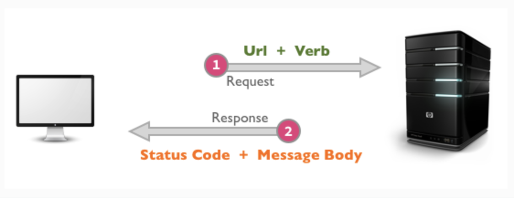
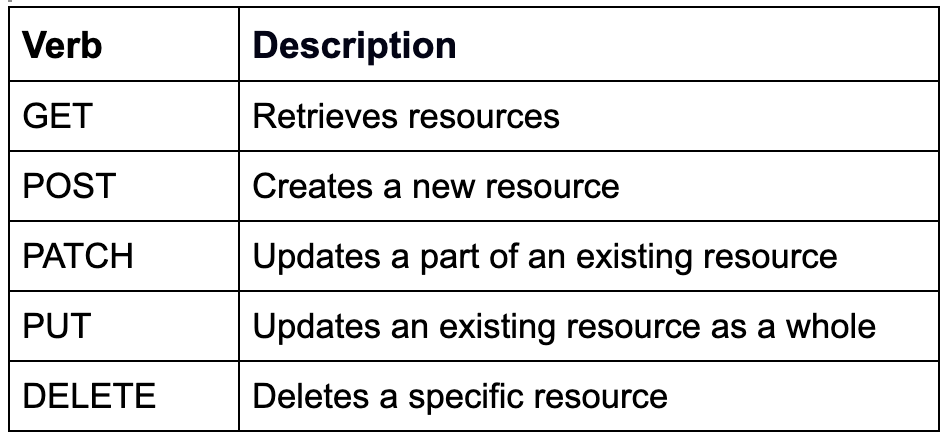
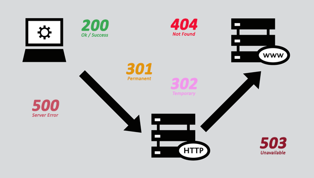

# Intro to Sinatra

### Lecture Deliverables:

- Create a web API server that can receive requests from a frontend application, such as React, and send back a JSON response that takes data from the database using your Active Record models.
- Create a GET request that will respond with all starships.
- Create a POST request that allows submission of a new starship.

### Lecture Take Aways:

- Request-response cycle
- HTTP methods
- APIs
- Active Record
- Rack
- Sinatra
- Routes
- Params
- Strong params
- Dynamic Routing

### What is the internet?

- A combination of communication between the server and client side



#### Request/Response flow:

1. User types in URL into the browser(client)
2. Server receives the request, processes it and provides a response
3. Response is rendered on client side 

#### HTTP:

- Short for Hyper Text Transfer Protocol
- HTTP is a protocol(guideline) used for client to server side communication and loading a website. Can also use HTTPS for a more secure communication

#### How do we know where to send the request? Hello, URL's

- Short for Uniform Resource Locators

Let's break it down:

```
http://localhost:9292/starships
```

1. `http` - the protocol 
2. `localhost:9292` - the domain(for now)
3. `/starships` - the endpoint 

#### CRUD and HTTP Verbs

- By default, the above request will make a `GET` request, but what happens when we want to make a different type of request? 

Let's look at HTTP Verbs:



#### Status Codes:




### Sinatra 

- A light weight framework used to build full stack web applications or provide an API
- Built with Ruby
- Uses Rack under the hood
- Good introduction to Rails 

#### RESTful Routing:

- `GET /starships`
- `GET /starships/:id`
- `POST /starships`
- `PATCH /starships/:id`
- `DELETE /starships/:id`